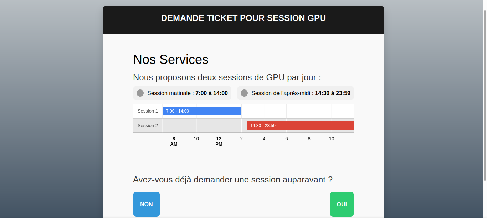
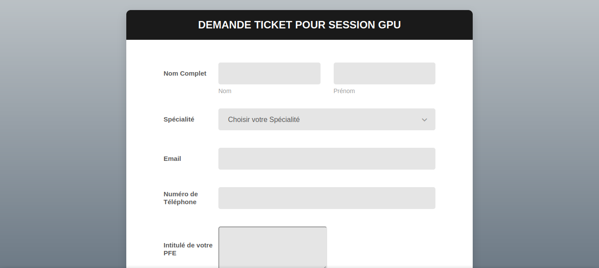

## Django-Celery-Redis Dynamic Session Ticketing System

This project leverages the power of Django, Celery, and Redis to manage user sessions on a high-performance ubuntu machine. Users can acquire tickets (comprising a username and password) from a webpage and the system adeptly handles session management tasks such as initiation, locking, and termination. This system was originally implemented for my School's Network Department to facilitate for them the management of students that benefits from the provided machine. 

Homepage and form for ticket access:

Features

- Creates automatically a user with a secured generated password (username=provided email) in the ubuntu system and locks its password until the scheduled session starts.
- Session Management: Start, lock, and end sessions with seamless orchestration using Celery.
- Django Admin can manually change the Session start datetime and length for each user.
- Autmatic email sending to the student using SMTP protocol
- High Concurrency: Built for performance with the robust capabilities of Celery and Redis.

Prerequisites

    Django==4.2.3
    watchdog
    pytz
    celery[redis]
    django-celery-beat
    django-celery-results

Installation

    Clone the repository:

    git clone https://github.com/Azzedde/pfe-gpu/

Navigate to the project directory and install the requirements:

    cd pfe-gpu
    pip install -r requirements.txt

Run migrations:

    python manage.py migrate

Start the Django development server:

    python manage.py runserver

Using Celery with Redis

To harness the full power of this system, ensure the Redis server is running and then start the Celery worker:

    celery -A your_project_name worker --loglevel=info

For real-time task monitoring, you can utilize Flower:

    celery -A your_project_name flower

## Contributing

Feel free to fork the project, create a feature branch, and send us a pull request.
